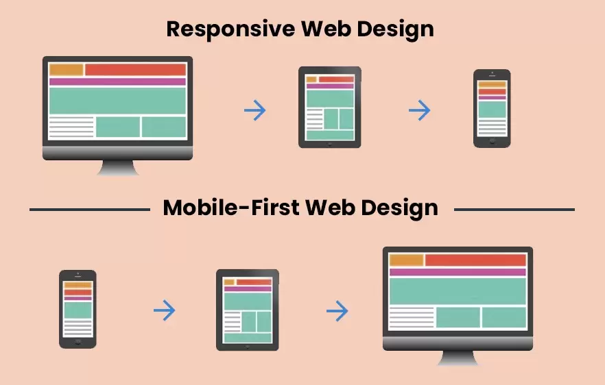
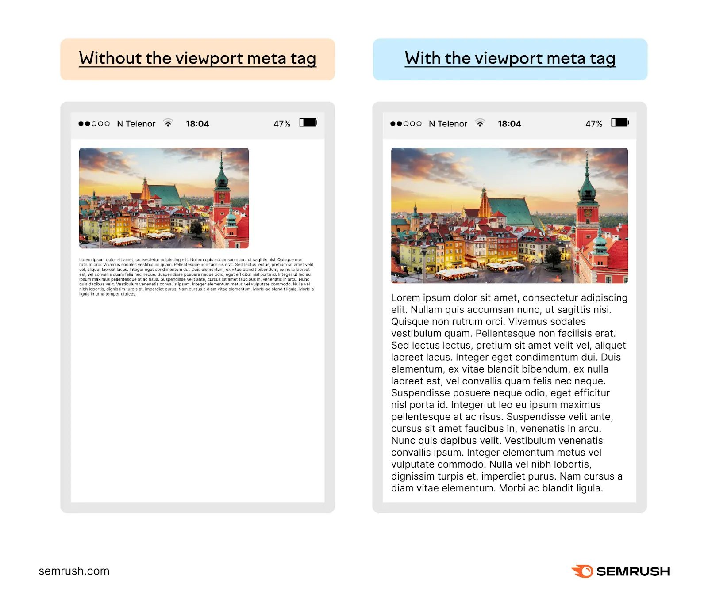

<!-- _class: lead
_paginate: skip -->

# Responsive Web Design

---

## Pendahuluan ke Responsive Web Design


Responsive Web Design (RWD) adalah teknik yang membuat desain web dapat menyesuaikan diri dengan berbagai ukuran layar dan perangkat tanpa harus membuat versi yang berbeda dari situs tersebut.

---

## Prinsip-Prinsip Dasar Responsive Web Design

- Fluid Grids
- Flexible Media
- Media Queries

---

## Fluid Grids

Fluid grids adalah tata letak berbasis grid yang menggunakan unit relatif seperti persentase (%) atau unit relatif (em, rem) untuk mengatur ukuran elemen.

---

## Flexible Media

Flexible media adalah konsep di mana gambar, video, dan media lainnya diatur agar secara otomatis menyesuaikan ukuran kontainernya, menghindari media yang terlalu besar untuk layar kecil.

```css
img {
  max-width: 100%;
  height: auto;
}
```

- max-width: 100% memastikan bahwa gambar tidak akan melampaui lebar kontainernya.
- height: auto memastikan bahwa proporsi gambar tetap terjaga meskipun ukurannya berubah.

---

## Media Queries

Media Queries adalah fitur CSS yang memungkinkan pengembang untuk menerapkan gaya yang berbeda berdasarkan kondisi perangkat, seperti ukuran layar, orientasi (potret atau lanskap), dan resolusi layar.

```css
/* Gaya untuk layar dengan lebar maksimum 768px (misalnya, perangkat mobile) */
@media (max-width: 768px) {
  .container {
    width: 100%
  }
}

/* Gaya untuk layar dengan lebar minimum 769px (misalnya, tablet atau desktop) */
@media (min-width: 769px) {
  .container {
    width: 50%
  }
}
```
---

## Responsive Images dan Media

Gunakan properti max-width: 100% untuk memastikan gambar tidak lebih besar dari kontainernya.
Atribut srcset digunakan untuk menyediakan gambar dengan resolusi berbeda.

```html

```

---

# Mobile-First Design

Desain mobile-first memprioritaskan pengalaman pengguna di perangkat mobile sebelum meningkatkan tampilan di layar yang lebih besar.



---

## Viewport Meta Tag

Pengertian: Viewport tag mengontrol skala dan dimensi tampilan di perangkat mobile.

```html
<meta name="viewport" content="width=device-width, initial-scale=1">
```

> Ini memastikan halaman beradaptasi dengan ukuran layar perangkat mobile.

---



---

## Typography Responsif

Gunakan unit relatif seperti rem dan em agar ukuran teks bisa berubah sesuai ukuran layar.

```css
body {
  font-size: 1rem; /* relatif terhadap ukuran font root */
}

@media (min-width: 1200px) {
  body {
    font-size: 1.2rem;
  }
}
```

---

## Framework untuk Responsive Design

Framework seperti `Bootstrap` memudahkan penerapan desain responsif dengan komponen yang sudah siap digunakan.

```html
<div class="row">
  <div class="col-md-4">Kolom 1</div>
  <div class="col-md-4">Kolom 2</div>
  <div class="col-md-4">Kolom 3</div>
</div>
```

---

## Flexbox

Digunakan untuk tata letak responsif yang satu dimensi (row atau column).

```css
.container {
  display: flex;
  flex-wrap: wrap;
}

.item {
  flex: 1 1 30%; /* Menyesuaikan ukuran item */
}
```

---

## CSS Grid

Cocok untuk tata letak dua dimensi yang lebih kompleks.

```css
.grid-container {
  display: grid;
  grid-template-columns: repeat(auto-fit, minmax(200px, 1fr));
}
```

---

## Responsive Navigation

Desain navigasi yang responsif biasanya menggunakan menu hamburger untuk tampilan mobile.

---

```html
<div class="navbar">
  <div class="menu-icon">&#9776;</div> <!-- Hamburger icon -->
  <ul class="nav-links">
    <li><a href="#">Home</a></li>
    <li><a href="#">About</a></li>
    <li><a href="#">Contact</a></li>
  </ul>
</div>

<style>
  .nav-links {
    display: none;
  }
  @media (min-width: 768px) {
    .nav-links {
      display: block;
    }
  }
</style>
```

---


##  Testing dan Debugging Responsive Design

Gunakan Chrome DevTools atau Firefox Developer Tools untuk memeriksa bagaimana situs tampil di berbagai perangkat.

**Contoh :** Di Chrome, buka situs, klik kanan → "Inspect" → pilih tampilan perangkat di toolbar.

---

## Progressive Enhancement dan Graceful Degradation

- Progressive Enhancement: Mulai dengan fitur dasar yang dapat diakses di semua perangkat, lalu tambahkan fitur-fitur lebih canggih untuk perangkat yang mendukung.

- Graceful Degradation: Memulai dari desain kompleks, namun situs tetap berfungsi dengan baik meskipun fitur-fitur canggih tidak tersedia.

---

## Performance Optimization untuk Desain Responsif

Gunakan lazy loading untuk menunda pemuatan gambar hingga diperlukan.
Minify CSS dan JavaScript untuk mengurangi ukuran file.

```html

```

---

## Tools dan Resources untuk Responsive Design

- Figma atau Sketch untuk membuat mockup responsif.
- Responsinator untuk menguji desain responsif di berbagai perangkat.
Contoh: Responsinator (https://www.responsinator.com) memungkinkan pengembang menguji situs mereka pada berbagai ukuran layar.

