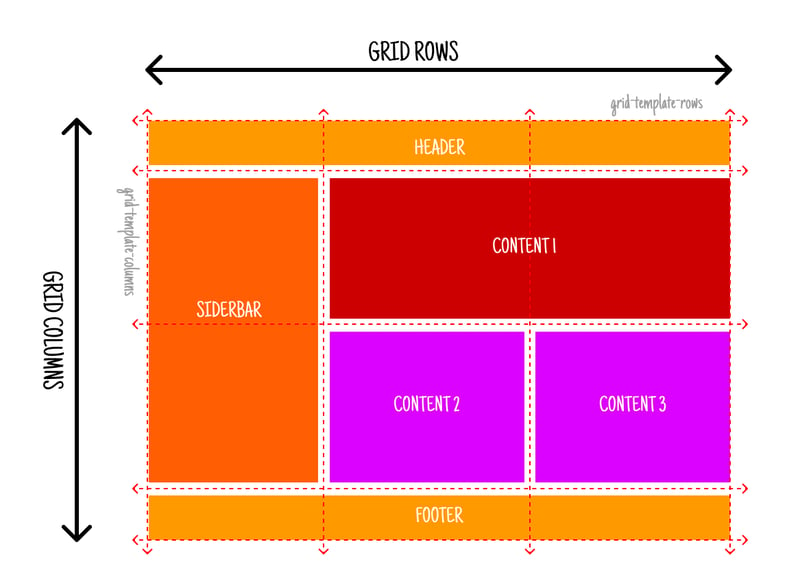
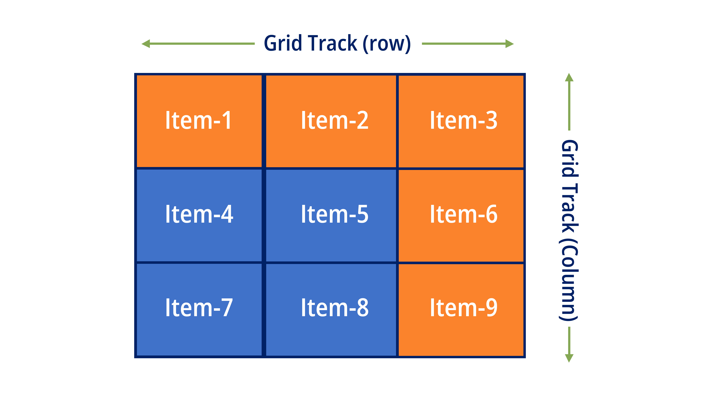
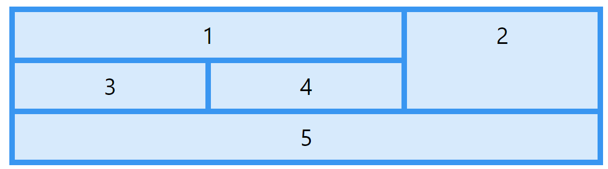
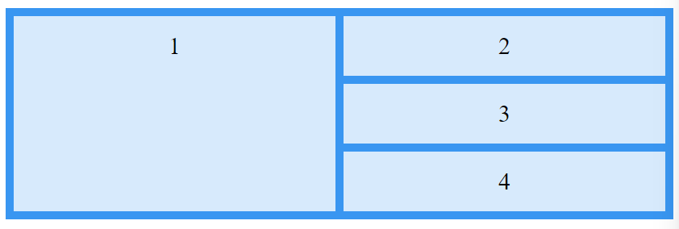
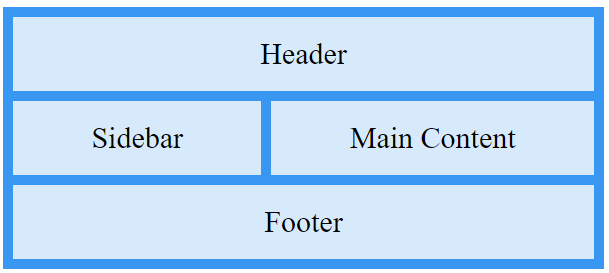

<!-- _class: lead
_paginate: skip -->

# Grid Layout



---

## Pengenalan Grid dalam Responsive Web Design

Grid Layout adalah teknik desain yang membagi halaman web ke dalam baris dan kolom, sehingga memudahkan dalam mengatur elemen-elemen dalam halaman secara terstruktur. Grid ini memungkinkan desain tetap konsisten di berbagai ukuran layar, baik itu perangkat mobile, tablet, atau desktop.

--- 

## Manfaat penggunaan grid dalam desain responsif


- Membuat layout lebih terorganisir dan rapi.
- Menyusun elemen berdasarkan baris dan kolom yang dapat disesuaikan dengan ukuran layar.
- Memungkinkan elemen layout menyesuaikan secara otomatis sesuai dengan ukuran viewport.

---

## CSS Grid Layout

CSS Grid Layout adalah sistem layout berbasis grid kolom dan baris yang memberikan fleksibilitas dalam menyusun elemen ke dalam baris dan kolom. 

---


Berikut beberapa konsep dasar:

- `Grid Container`: Elemen induk yang berfungsi sebagai wadah grid.
- `Grid Items`: Elemen-elemen anak yang ditempatkan dalam grid container.
- `Grid Track`: Baris (row) dan kolom (column) di dalam grid.

---

## Properti dasar CSS Grid:

```css
.container {
  display: grid;
  /* Membuat 3 kolom dengan lebar yang sama */
  grid-template-columns: repeat(3, 1fr); 
  /* Jarak antar elemen grid */
  grid-gap: 20px; 
}
```

---

## Satuan `fr`

Satuan `fr (fractional unit)` adalah unit fleksibel yang digunakan di Grid CSS untuk membagi ruang yang tersedia di antara kolom atau baris grid. Ini mirip dengan persentase, tetapi membagi ruang berdasarkan jumlah unit `fr` yang ditentukan.

```css
grid-template-columns: 1fr 1fr 1fr;
grid-template-columns: 2fr 1fr;
grid-template-columns: 200px 1fr 2fr;
```

---

## Fungsi `repeat()`

Fungsi `repeat()` memungkinkan Anda menentukan pola pengulangan grid track (kolom atau baris) tanpa harus menuliskannya satu per satu. Ini membantu kode Anda menjadi lebih ringkas dan mudah dikelola.

```css
grid-template-columns: repeat(3, 1fr);
grid-template-columns: repeat(4, 200px);
grid-template-columns: repeat(auto-fit, minmax(150px, 1fr));
```

---

## Contoh Kasus Implementasi Grid Responsif

Misalkan kita ingin membuat layout yang memiliki 3 kolom pada layar desktop, tetapi hanya 1 kolom pada layar kecil (mobile):

```css
.container {
  display: grid;
  grid-template-columns: repeat(3, 1fr); /* 3 kolom pada layar besar */
  grid-gap: 20px;
}

@media (max-width: 768px) {
 .container {
  grid-template-columns: 1fr; /* 1 kolom pada layar kecil */
 }
}
```

---

## Pengertian Grid Item



Dalam CSS Grid Layout, grid item adalah elemen-elemen yang berada di dalam grid container. 

---

## Properti untuk Mengatur Grid Item

Ada beberapa properti yang bisa digunakan untuk mengatur posisi dan ukuran grid item di dalam grid container:

- `grid-column-start` dan `grid-column-end`: Mengatur di mana grid item memulai dan mengakhiri pada kolom grid.
- `grid-row-start` dan `grid-row-end`: Mengatur di mana grid item memulai dan mengakhiri pada baris grid.
- `grid-area`: Mengatur posisi grid item berdasarkan kombinasi dari kolom dan baris.
- `justify-self` dan `align-self`: Mengatur posisi grid item di dalam sel grid secara horizontal dan vertikal.

---

## Mengatur Grid Item dengan Grid Lines


```html
<div class="grid-container">
  <div class="item1">1</div>
  <div class="item2">2</div>
  <div class="item3">3</div>  
  <div class="item4">4</div>
</div>
```

--- 

```css
.grid-container > div {
  background-color: rgba(255, 255, 255, 0.8);
  text-align: center;
  padding: 20px 0;
  font-size: 30px;
}

.grid-container {
  display: grid;
  grid-template-columns: auto auto;
  gap: 10px;
  background-color: #2196F3;
  padding: 10px;
}

.item1 {
  grid-row: 1 / 4;
}
```

---

## Grid Area



Grid area adalah konsep di CSS Grid Layout yang digunakan untuk menentukan area tertentu di dalam grid tempat sebuah grid item ditempatkan.

---

```css
.grid-container {
  display: grid;
  grid-template-areas: 
    "header header"
    "sidebar main"
    "footer footer";
  gap: 10px;
  background-color: #2196F3;
  padding: 10px;
}

.header {
  grid-area: header;
}

.sidebar {
  grid-area: sidebar;
}

.main {
  grid-area: main;
}

.footer {
  grid-area: footer;
}
```

---

```html
<div class="grid-container">
  <div class="header">Header</div>
  <div class="sidebar">Sidebar</div>
  <div class="main">Main Content</div>
  <div class="footer">Footer</div>
</div>
```