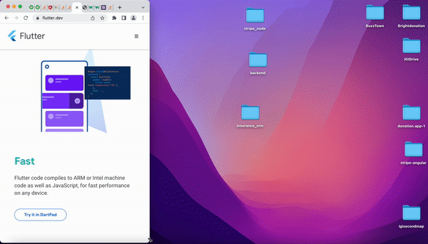

<!-- 
_class: lead
_paginate: skip 
_footer: https://getbootstrap.com
-->

# Bootstrap CSS Framework


---

## Apa Itu Bootstrap?
   
- Bootstrap adalah framework front-end open-source yang digunakan untuk membangun situs web dan aplikasi yang responsif dan modern. 

- Bootstrap menyediakan kumpulan komponen seperti grid system, tombol, form, dan elemen UI lain yang dapat digunakan dengan mudah. 

- Bootstrap pertama kali dikembangkan oleh tim Twitter pada tahun 2011 untuk meningkatkan konsistensi desain antar proyek.

--- 

<!-- 
_class: lead 
_paginate: skip
-->

## Kelebihan Bootstrap

--- 

## Responsif

Dengan grid system dan komponen-komponennya, Bootstrap membantu membangun website yang secara otomatis menyesuaikan dengan berbagai ukuran layar.



---

## Mudah Digunakan

Dengan beberapa kelas CSS, kita dapat membangun layout dan komponen UI yang kompleks.


---

## Instalasi Bootstrap

Anda dapat menggunakan Bootstrap dengan mudah melalui CDN _(Content Delivery Network)_ tanpa harus mengunduh file apapun. 

```html
<link href="https://cdn.jsdelivr.net/npm/bootstrap@5.3.3/dist/css/bootstrap.min.css" rel="stylesheet">
<script src="https://cdn.jsdelivr.net/npm/bootstrap@5.3.3/dist/js/bootstrap.bundle.min.js"></script>
```

---

## Grid System

Grid system adalah fitur utama Bootstrap yang membantu mengatur layout dengan fleksibilitas tinggi. Grid dibagi menjadi 12 kolom, yang dapat dikombinasikan untuk berbagai ukuran layar (xs, sm, md, lg, xl, xxl).

```html
<div class="container">
  <div class="row">
    <div class="col-md-4">Kolom 1</div>
    <div class="col-md-4">Kolom 2</div>
    <div class="col-md-4">Kolom 3</div>
  </div>
</div>
```

Pada contoh ini, tiga kolom akan berada di samping satu sama lain pada layar medium (md) ke atas, dan akan disusun ulang menjadi satu kolom pada layar yang lebih kecil.

---

## Komponen Bootstrap

Bootstrap menyediakan berbagai komponen siap pakai yang memudahkan pembuatan elemen UI.

---

## Navbar

Navbar adalah komponen navigasi yang dapat dibuat responsif dengan mudah.
   
```html
<nav class="navbar navbar-expand-lg navbar-light bg-light">
  <a class="navbar-brand" href="#">Navbar</a>
  <button class="navbar-toggler" type="button" data-toggle="collapse" data-target="#navbarNav">
    <span class="navbar-toggler-icon"></span>
  </button>
  <div class="collapse navbar-collapse" id="navbarNav">
    <ul class="navbar-nav">
      <li class="nav-item"><a class="nav-link" href="#">Home</a></li>
      <li class="nav-item"><a class="nav-link" href="#">Features</a></li>
      <li class="nav-item"><a class="nav-link" href="#">Pricing</a></li>
    </ul>
  </div>
</nav>
```

---

## Buttons

Bootstrap menyediakan berbagai varian tombol.

```html
<button class="btn btn-primary">Primary Button</button>
<button class="btn btn-secondary">Secondary Button</button>
```

---

## Alerts

Untuk menampilkan pesan notifikasi.

```html
<div class="alert alert-success" role="alert">
  This is a success alert—check it out!
</div>
```

## Utilities dan Helper Classes

Bootstrap menyediakan berbagai utilities untuk mengatur spacing, typography, dan layout dengan cepat.

--- 

## Spacing

Kelas-kelas seperti `.m-` dan `.p-` digunakan untuk margin dan padding.
   
```html
<div class="p-3 mb-2 bg-primary text-white">Padding dan Margin diatur dengan class .p-3 .mb-2</div>
```

---

## Typography

Kelas seperti `.text-center` atau `.font-weight-bold` dapat digunakan untuk mengatur tampilan teks.

```html
<h1 class="text-center">Judul di Tengah</h1>
```

---

## Responsive Design dengan Bootstrap

Bootstrap adalah framework yang dirancang dengan pendekatan `mobile-first`, yang berarti layoutnya dirancang untuk perangkat mobile terlebih dahulu, lalu diperluas untuk perangkat yang lebih besar menggunakan breakpoint.

Contoh Media Queries di Bootstrap:
```html
<div class="d-none d-md-block">Hanya muncul di layar medium ke atas</div>
```

---

## Bootstrap Icons (Opsional)

Bootstrap Icons adalah pustaka ikon yang dapat diintegrasikan ke proyek Bootstrap.

Contoh Penggunaan Bootstrap Icons:
```html
<i class="bi bi-alarm"></i>
```
