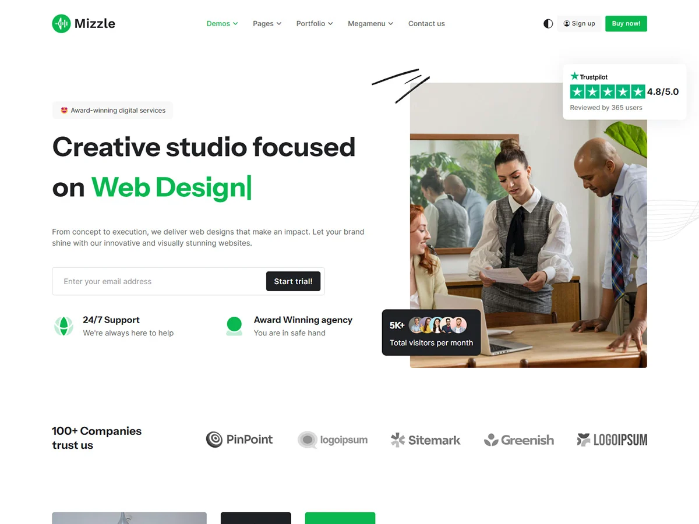
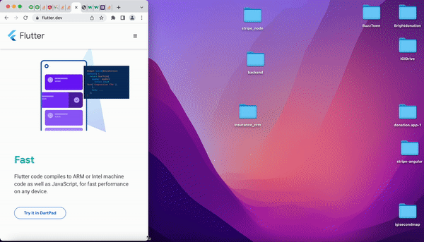

<!-- 
_class: lead
_paginate: skip 
_footer: https://getbootstrap.com

-->
# Bootstrap CSS Framework


---

## Apa Itu Bootstrap?
   
* Bootstrap adalah framework front-end open-source yang digunakan untuk membangun situs web dan aplikasi yang responsif dan modern. 

* Bootstrap menyediakan kumpulan komponen seperti `grid system`, `button`, `form`, dan elemen UI lain yang dapat digunakan dengan mudah. 

* Bootstrap pertama kali dikembangkan oleh tim Twitter pada tahun 2011 untuk meningkatkan konsistensi desain antar proyek.

--- 

<!-- 
_class: lead 
_paginate: skip
-->

## Kelebihan Bootstrap

--- 

## Mudah Digunakan

Dengan beberapa kelas CSS, kita dapat membangun layout dan komponen UI yang kompleks.



---

## Responsif

Dengan grid system dan komponen-komponennya, Bootstrap membantu membangun website yang secara otomatis menyesuaikan dengan berbagai ukuran layar.



---

## Instalasi Bootstrap

Anda dapat menggunakan Bootstrap dengan mudah melalui CDN _(Content Delivery Network)_ tanpa harus mengunduh file apapun. 

```html
<link href="https://cdn.jsdelivr.net/npm/bootstrap@5.3.3/dist/css/bootstrap.min.css" rel="stylesheet">
<script src="https://cdn.jsdelivr.net/npm/bootstrap@5.3.3/dist/js/bootstrap.bundle.min.js"></script>
```

---

## Komponen Bootstrap

Bootstrap menyediakan berbagai komponen siap pakai yang memudahkan pembuatan elemen UI.

---

## Dokumentasi Bootstrap

https://getbootstrap.com/docs/
